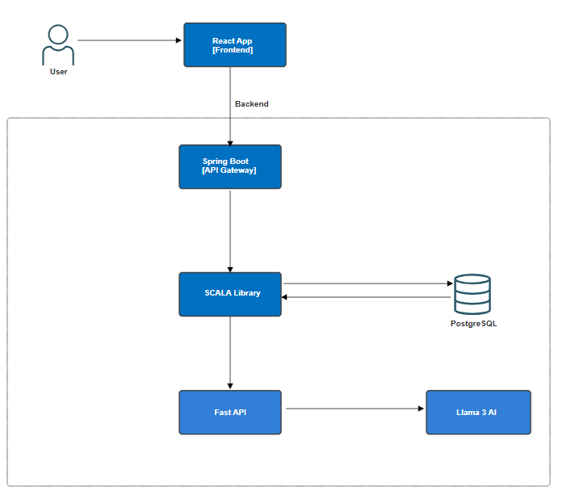

# 🌐 Website Summarizer

## 🧠 Project Overview

**Website Summarizer** is a full-stack AI-driven application that enables users to input one or two website URLs and get concise, LLM-powered summaries of the content. The app also maintains a searchable and deletable history of all summarization requests.

---

## 🎯 Key Features

- 🔍 **Summarize Websites**: Input URLs to generate short summaries via an AI language model.
- 📜 **History Management**: View previous summarization logs where a separate history is created for each tab browsing data. 
- 🧩 **Modular Microservice Architecture**: Built with separate components for scalability and flexibility.
- 🐳 **Cloud Native**: Fully containerized and deployable with Helm and Minikube.

---

## 🏗️ Architecture

This project is structured as a microservices-based system, where each component communicates via REST APIs and has a defined responsibility.
## 📚 Components Overview
- **User**
  - Interacts with the system via a frontend interface.
- **React Frontend**
  - UI built with React, responsible for user interaction.
- **Spring Boot (API Gateway)**
  - Central gateway that routes requests to SCALA Library.
- **Scala Backend**
  - Handles core business logic and interacts with the PostgreSQL database and Python Fast API.
- **PostgreSQL DB**
  - Relational database used for persistent storage of summary details.
- **Python FastAPI**
  - Handles request to Llama 3 LLM API.
- **LLM Interface API Key**
  - Secure connection to external Large Language Model APIs to search and fetch the results from web.

## 🧱 Architecture Flow Diagram

	


Each service runs in its own container and can be deployed using Helm charts in a local or cloud Kubernetes environment.

---

## 💻⏯️Working Walkthrough
- [Click here for the working demo](https://drive.google.com/file/d/1qLfTvF9H9VkrJ4ohNXZZdoTUVn0SGDjI/view?usp=drive_link)
- [Click here for the code walthrough](https://drive.google.com/file/d/1qLfTvF9H9VkrJ4ohNXZZdoTUVn0SGDjI/view?usp=drive_link)
- [Get the project](https://drive.google.com/drive/folders/1hPGLqPMOYvcksMcrUn6rI7Z5fCyfSTyF?usp=drive_link)


---

## 🧱 Components

### 1. 📦 Spring Boot API Gateway
- **Language**: Java
- **Tooling**: Gradle
- **Role**: Central API layer that connects frontend requests to backend logic.

**Responsibilities**:
- Accept user input (URLs) from the frontend.
- Call Scala service for processing and history logging.
- Return summaries and past results.

---

### 2. 🧪 Scala Backend Service
- **Language**: Scala
- **Tooling**: Gradle
- **Role**: Business logic handler.

**Responsibilities**:
- Orchestrate summarization flow.
- Save and retrieve records from PostgreSQL.
- Call FastAPI service for actual content summarization.

---

### 3. 🧠 Python FastAPI Service
- **Language**: Python
- **Framework**: FastAPI
- **Role**: LLM interface (e.g., OpenAI, Hugging Face).

**Responsibilities**:
- Extract webpage content.
- Query an LLM and return generated summaries.

---

### 4. 💻 React Frontend
- **Language**: JavaScript (React)
- **Role**: User-facing interface.

**Responsibilities**:
- Form to input URLs.
- Display summaries and past requests.
- Allow deletion of history entries.

---

### 5. 🗃️ PostgreSQL
- **Role**: Stores summarization history.

**Table Schema**:
```sql
CREATE TABLE request_history (
        id SERIAL PRIMARY KEY,
        url VARCHAR(255) NOT NULL,
        summary TEXT NOT NULL,
        timestamp TIMESTAMPTZ DEFAULT CURRENT_TIMESTAMP
	user_id VARCHAR(255) NOT NULL
);

```

### 🔄 Workflow: End-to-End Request Flow:
1. 🧑 User Interaction
   - The user submits one or two website URLs (e.g., LinkedIn, news articles) via the React frontend.

2. 🚪 API Gateway (Spring Boot)
   - The frontend sends the URLs to the Spring Boot API Gateway.
   - The gateway validates the request and forwards it to the Scala backend.

3. ⚙️ Business Logic Layer (Scala Backend)
   - Receives the request from the Spring Boot gateway.
   - Logs the original URL(s) and request metadata in PostgreSQL.
   - Sends the URL(s) to the Python FastAPI service for summarization.

4. 🤖 Summarization (Python FastAPI + LLM)
   - FastAPI fetches and parses content from the target URLs.
   - It calls the external LLM (e.g., OpenAI, Llama-3 [in my case]) to generate a summary.
   - The summarized content is returned to the Scala backend.

5. 🗃️ Storage and Response Handling (Scala)
   - The Scala service saves the summary in PostgreSQL along with timestamp and URL.
   - It sends the response back to the Spring Boot API Gateway.

6. 🌐 Frontend Rendering (React)
   - The frontend receives the final summary via the Spring Boot layer.
   - Displays the summarized text to the user.
   - Updates the History page with recent and past summaries.


---


## 🚀 Getting Started

This guide walks you through running the full-stack Website Summarizer project locally using Docker, Helm, and Minikube. The project is split into multiple services: React frontend, Spring Boot API Gateway, Scala backend, Python FastAPI, and PostgreSQL database.

### Project Structure

```text
.
├── fastapi-service/       # Python FastAPI service for LLM interaction
├── scala-backend/         # Scala backend for orchestration and business logic
├── spring-gateway/        # Java Spring Boot API Gateway
├── react-frontend/        # React frontend UI
├── helm-charts/           # Helm deployment charts
└── postgres-db/           # PostgreSQL schema and config

```

---

## 🔧 Prerequisites

Ensure the following tools are installed on your system:

- Docker

- Helm

- Minikube (or a Kubernetes cluster)

- PostgreSQL

- Node.js (for React)

- Gradle (for Spring Boot and Scala)

- Python 3.9+ (for FastAPI)


## 🛠️ Local Setup Instructions

### 1. 🗃️ Set Up PostgreSQL

**Install PostgreSQL**  
If you haven’t already installed PostgreSQL, you can follow the official installation guide for your operating system:
- [PostgreSQL Installation Guide](https://www.postgresql.org/download/)

**Create Database and Table**

Once PostgreSQL is installed, follow these steps to create the required table:

a. Log in to the PostgreSQL database with the following command:

```bash
    psql -U postgres
```

b. Create a new database `summarize`:

```sql
    CREATE DATABASE summarize;
```

c. Connect to the `summarize` database:

```sql
    \c summarize
```

d. Create the `summarizer_logs` table with the following SQL:

```sql
    CREATE TABLE request_history (
        id SERIAL PRIMARY KEY,
        url VARCHAR(255) NOT NULL,
        summary TEXT NOT NULL,
        timestamp TIMESTAMPTZ DEFAULT CURRENT_TIMESTAMP
	user_id VARCHAR(255) NOT NULL
    );
```
Example of configuration in a `application.conf` file of the scala library:

```application.conf
db {
  url = "jdbc:postgresql://localhost:8000/summarize"
  user = "postgres"
  password = "postgres"
}
```
(Make sure the password for the 'postgres' user you created is same as the one you enter in the application.conf.)


### 2. **Run Python FastAPI**

a. Navigate to the `./Backend/FastAPI/web-summarizer-fastapi` directory.
b. Create a `.env` file and add your Llama3 AI model key in the following format:

```env
   "GROQ_API_KEY=your_groq_api_key" 
```
c. Run the FastAPI server with the following command:

```bash
    uvicorn main:app --reload
```

### 3. **Build Scala Library**

To build the Scala summarizer library:

1. Navigate to the `./Backend/Scala/WebsiteSummarizer` directory.

2. Run the following command to build the Scala library:

    ```bash
    gradle clean build fatjar
    ```
3. After building, optionally copy the generated JAR file  `/libs` to the Spring Boot libs directory `Springboot/WebSummarizer` for use by the API gateway:

   ```bash
	cp build/libs/*.jar ../Springboot/WebSummarizery/libs/
   ```

### 4. **Run Spring Boot API Gateway**


1. Navigate to the `/Backend/Springboot/WebSummarizer` directory.
2. Run the Spring Boot application with the following command:

    ```bash
    gradle bootRun
    ```

### 5. **Start React Frontend**

To run the React frontend:

1. Navigate to the `/frontend` directory.
2. Install the required dependencies by running:
    ```bash
    npm install
    ```
3. Once the dependencies are installed, start the React development server with:
    ```bash
    npm start
    ```
    
### 6. ***Deploying on Minikube with Helm***

If you want to deploy the entire project on a local Kubernetes cluster with Helm charts, follow these steps:

#### 6.1 ****Start Minikube****
Allocate enough resources for your cluster:

```bash
minikube start --memory=7500 --cpus=4
```
#### 6.2 ****Deploy Services via Helm****
Run the following commands sequentially to deploy all components:

```bash
# Deploy PostgreSQL
helm install pg ./helm-charts/postgres

# Deploy FastAPI Service (LLaMA 3 interface)
helm install summarizer-fastapi ./helm-charts/fastapi

# Deploy Scala Backend
helm install summarizer-scala ./helm-charts/scala-backend

# Deploy Spring Boot API Gateway
helm install summarizer-gateway ./helm-charts/spring-boot

# Deploy React Frontend
helm install summarizer-frontend ./helm-charts/frontend
```

#### ****6.3 Verify Deployment****
Check that all pods are running successfully:

```bash
kubectl get pods
```

---

## 🧪 Troubleshooting Tips
- ✅ Verify Environment Variables: Ensure .env files, Helm values.yaml files, and all configuration files have correct API keys, database credentials, and service URLs.

- ✅ Test Service Communication: To test connectivity between pods, run:

```bash
kubectl exec -it <pod-name> -- curl http://<service-name>:<port>
```
Replace `<pod-name>`, `<service-name>`, and `<port>` accordingly.

- 🐛 View Logs for Errors:

```bash
kubectl logs <pod-name>
```

- ⚠️ If you encounter build or runtime errors, ensure dependencies like Docker, Helm, Minikube, Node.js, Gradle, and Python 3.9+ are installed and configured properly.

---

## 📚 Tech Stack Overview

| Layer         | Technology                         |
| ------------- | --------------------------------- |
| **Frontend**      | React, Typescript                 |
| **API Gateway**   | Spring Boot (Java)                |
| **Logic Service** | Scala + STTP                     |
| **LLM Interface** | FastAPI (Python) with LLaMA 3 API|
| **Database**      | PostgreSQL                       |
| **Deployment**    | Docker, Helm, Minikube           |

---
 For additional help, please refer to the documentation or open an issue in the repository.


